# Trello
Trello Functionality Clone

# Application Guide #

**1.** Go to My [Trello-Clone](https://trello-clone-a597d.web.app/register) Website
 

**2.** Enter register information and click register. Link will be sent on the email
 you enter, for email veriIcation.
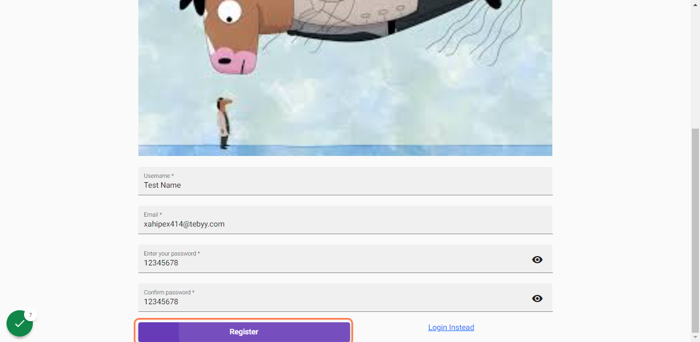
 
**3.** Click on link, to verify email.
 
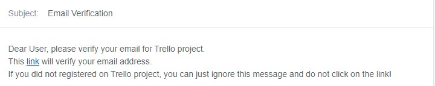
 
**4.** Enter login information and click Log In. pou will be redirected to your proIle
page.
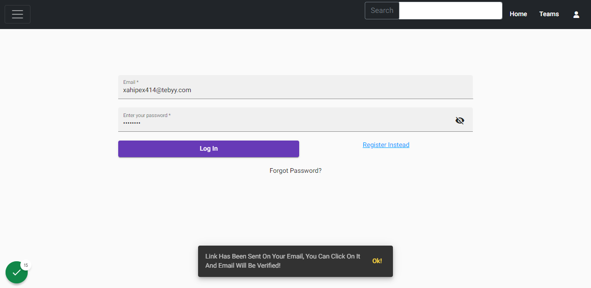
 
**5.** Click on Add Team button
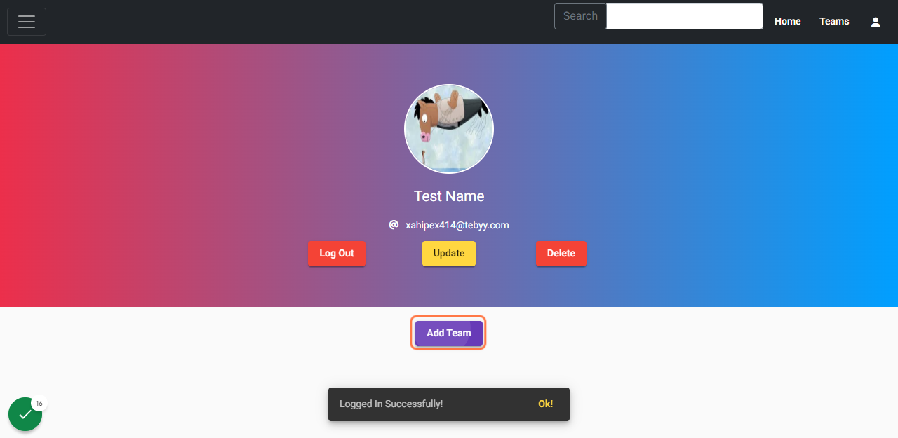
 
**6.** Enter team title and upload team cover picture and click save.
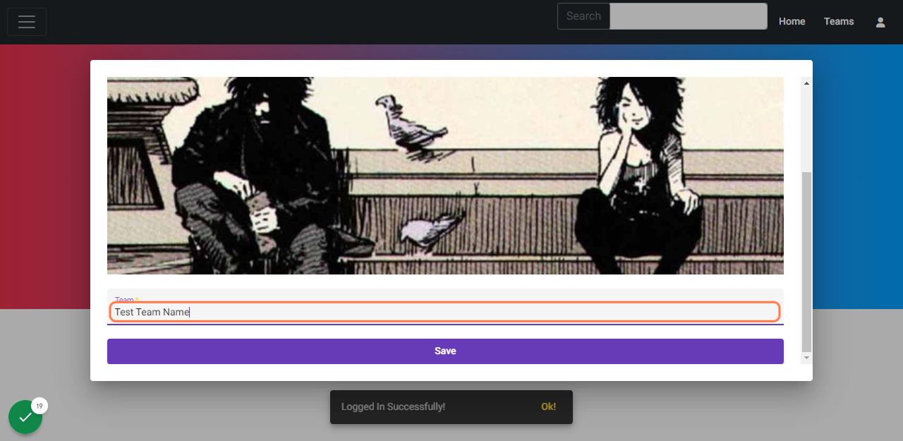
 
**7.** Search for other users to invite them to your team.
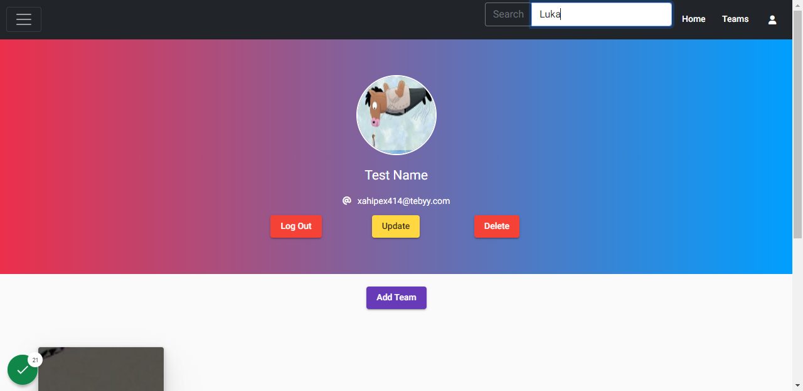
 
**8.** Click on Invite To Team button
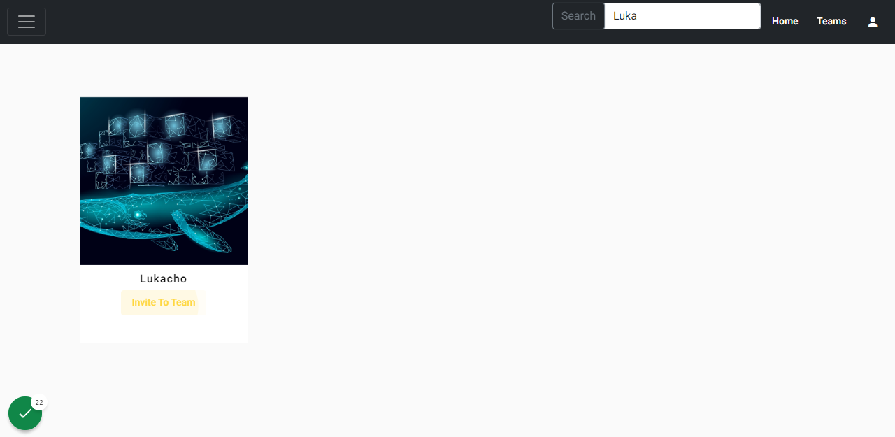
 
**9.** Click on the team name, you want to invite the user. Ynvitation link will be
 sent to that user/s email. When user acce"ts invitation heDshe will be added
 to your team.
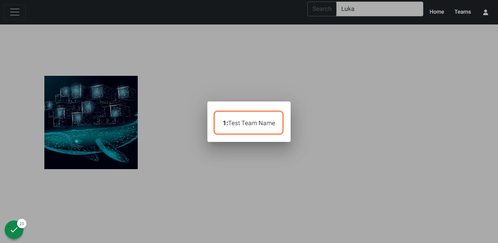
 
**10.** Click on See Team
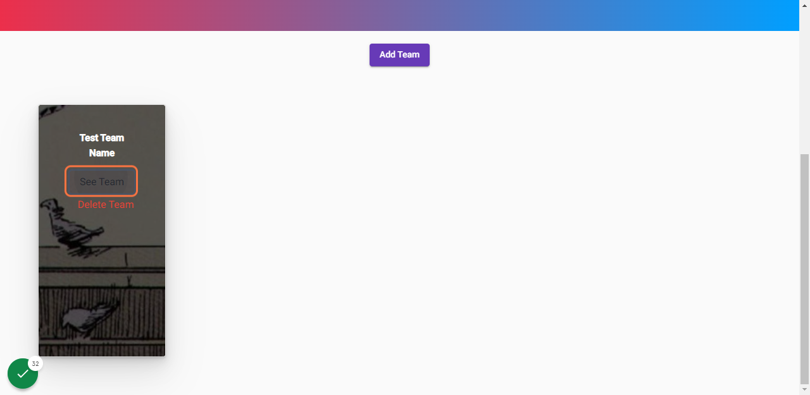
 
**11.** Click on Add Todo
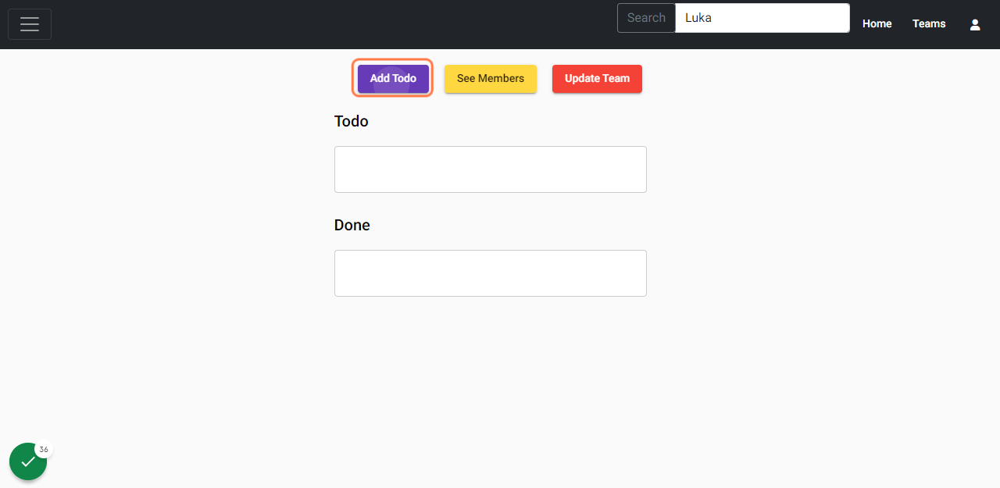
 
**12.** Enter ToDo information and click add.
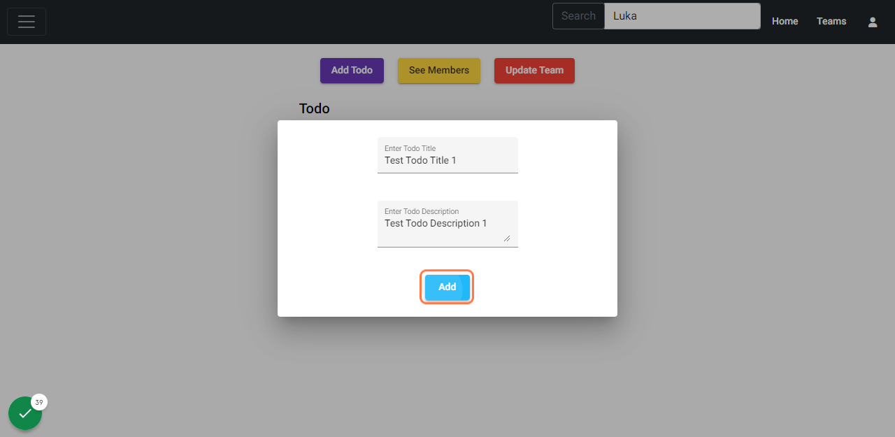
 
**13.** Add multiple ToDos.
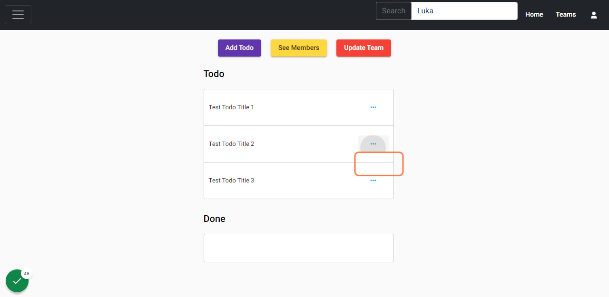
 
**14.** You can drag and drop ToDo items.
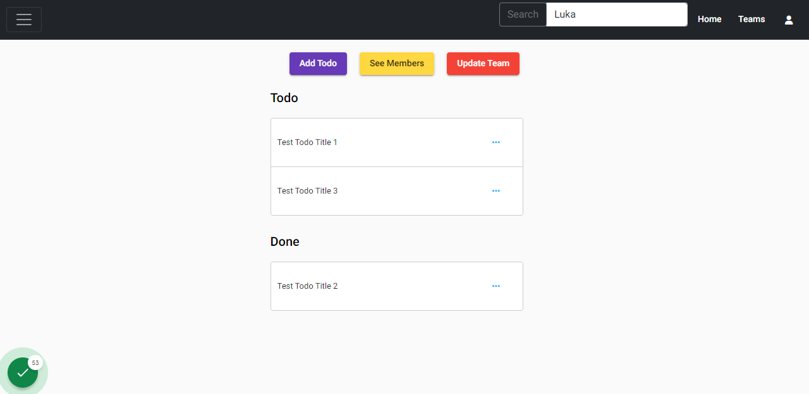
 
**15.** You can see and delete team members by clicking See Members button
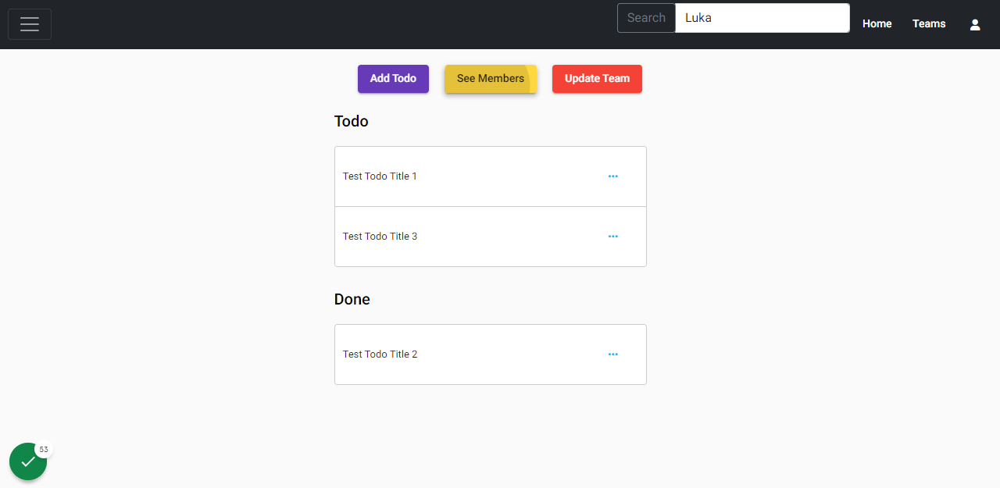
 
**16.** Click on Update Team and update team's information
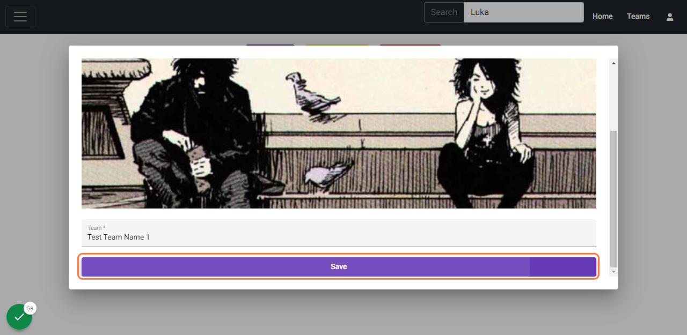
 
**17.** Click on Belete Team
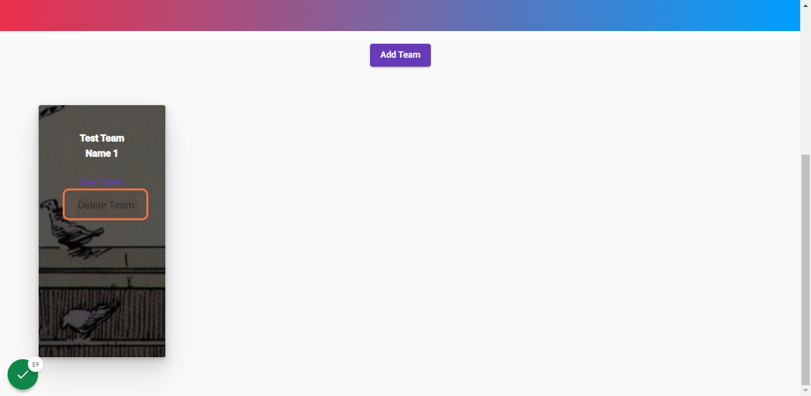
 
